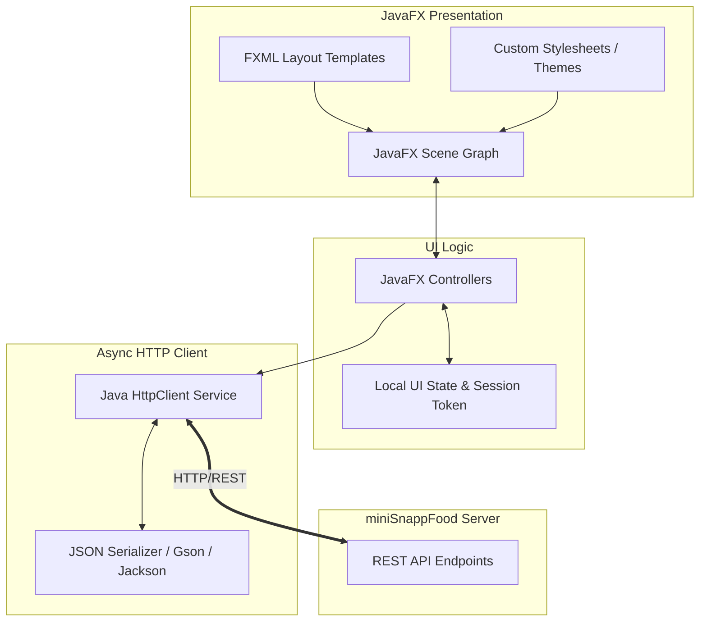

# 🍕 SnappFoodFront - Desktop Client Application

[](https://www.oracle.com/java/)
[](https://openjfx.io/)
[](https://openjfx.io/)
[](https://github.com/MParsa-ES/miniSnappFood)
[](LICENSE)

> **SnappFoodFront** is the official JavaFX desktop client application for the **miniSnappFood** ecosystem. Designed with a modern, reactive, and user-friendly GUI, it seamlessly interacts with the `miniSnappFood` REST API backend to provide real-time food ordering, restaurant management, and live order tracking experiences.

---

## 📋 Table of Contents

- [Overview](#-overview)
- [Key Features](#-key-features)
  - [🛍️ Customer Interface](#️-customer-interface)
  - [🏪 Restaurant Manager Interface](#-restaurant-manager-interface)
  - [🛵 Delivery & Admin Panel](#-delivery--admin-panel)
- [Architecture & Design Pattern](#-architecture--design-pattern)
- [Tech Stack](#-tech-stack)
- [Project Directory Structure](#-project-directory-structure)
- [Getting Started](#-getting-started)
  - [Prerequisites](#prerequisites)
  - [Installation & Build](#installation--build)
  - [Running the Application](#running-the-application)
- [Backend Connection Configuration](#-backend-connection-configuration)
- [UI Screenshots](#-ui-screenshots)
- [Contributing](#-contributing)
- [License & Author](#-license--author)

---

## 🔍 Overview

**SnappFoodFront** brings the full capabilities of an Iranian food delivery service to the desktop. Built using **JavaFX** and decoupled from backend implementation details via clean RESTful HTTP APIs, it features asynchronous network handling (`CompletableFuture` & `HttpClient`) to keep the user interface smooth, non-blocking, and highly responsive.

---

## ✨ Key Features

### 🛍️ Customer Interface
* **Authentication & User Profile:** Quick login/registration, profile info management, and digital wallet top-up/balance checking.
* **Restaurant Marketplace:** Browse active restaurants, filter by food categories, search by name, and view restaurant ratings/reviews.
* **Dynamic Menu & Shopping Cart:** View categorized food items, customize quantities, and see real-time price calculations.
* **Checkout & Wallet Payment:** Seamless checkout process connected to the digital wallet balance.
* **Live Order Tracking:** Real-time visual progress of active orders (e.g., *Submitted ➔ Preparing ➔ On the Way ➔ Delivered*).

### 🏪 Restaurant Manager Interface
* **Menu Management Dashboard:** Easily add new dishes, update prices, edit descriptions, and toggle item availability in real-time.
* **Live Order Processing Panel:** Receive incoming customer orders instantaneously and update status from preparation to dispatch.
* **Customer Feedback:** View ratings and feedback submitted by customers for past orders.

### 🛵 Delivery & Admin Panel
* **Delivery Management:** View pending deliveries and update order progress for customer notifications.
* **Platform Overview:** High-level dashboard for managing users and platform activity.

---

## 📐 Architecture & Design Pattern

The client application follows the **MVC (Model-View-Controller)** pattern combined with an **Asynchronous Service Layer** for HTTP communication:



---

## 💻 Tech Stack

* **GUI Framework:** JavaFX 21
* **Layout Markup:** FXML (Scene Builder compatible)
* **Styling:** Custom CSS (Modern Material/SnappFood Theme)
* **HTTP & Async Network:** Java `java.net.http.HttpClient` & `CompletableFuture`
* **JSON Parsing:** Jackson / Gson
* **Build Tool:** Apache Maven / Gradle
* **Required JDK:** Java OpenJDK 17+ / 21

---

## 📁 Project Directory Structure

```text
SnappFoodFront/
├── src/
│   └── main/
│       ├── java/
│       │   └── com/snappfood/front/
│       │       ├── app/                # Main JavaFX Application launcher
│       │       ├── controllers/        # FXML Scene Controllers
│       │       │   ├── auth/           # Login & Register controllers
│       │       │   ├── customer/       # Marketplace, Cart, Tracking controllers
│       │       │   └── restaurant/     # Menu management controllers
│       │       ├── network/            # REST API Client & Request Handler
│       │       ├── models/             # Client-side Data Models (POJOs)
│       │       └── utils/              # Session manager, Alert helpers, Scene Switcher
│       └── resources/
│           ├── fxml/                   # FXML Layout Files
│           │   ├── login.fxml
│           │   ├── main_customer.fxml
│           │   ├── restaurant_dashboard.fxml
│           │   └── checkout.fxml
│           ├── css/                    # Custom CSS Stylesheets
│           │   └── styles.css
│           └── images/                 # App Icons & Assets
├── pom.xml                             # Maven Dependencies & Plugins
└── README.md                           # Documentation
```

---

## 🚀 Getting Started

### Prerequisites

* **JDK 17 or higher** (JDK 21 recommended)
* **Maven 3.8+**
* Running instance of the [miniSnappFood Backend Server](https://github.com/MParsa-ES/miniSnappFood)

Verify installed versions:
```bash
java -version
mvn -version
```

---

### Installation & Build

1. **Clone the Repository:**
   ```bash
   git clone https://github.com/MParsa-ES/SnappFoodFront.git
   cd SnappFoodFront
   ```

2. **Build the Project with Maven:**
   ```bash
   mvn clean compile
   ```

---

### Running the Application

Ensure the `miniSnappFood` backend server is running on `http://localhost:8080` (or update configuration accordingly).

Run the application using the JavaFX Maven plugin:
```bash
mvn javafx:run
```

Alternatively, you can build a runnable `.jar`:
```bash
mvn clean package
java -jar target/SnappFoodFront-1.0.0.jar
```

---

## ⚙️ Backend Connection Configuration

By default, the application connects to the local backend API server. If your backend is hosted on a custom host or port, update the configuration file in:

`src/main/java/com/snappfood/front/network/ApiConfig.java`

```java
public class ApiConfig {
    public static final String BASE_URL = "http://localhost:8080/api";
}
```

---


## 📜 License & Author

Distributed under the **MIT License**. See `LICENSE` for more details.

**Authors:**
* **MohammadParsa Esmaeili** ([@MParsa-ES](https://github.com/MParsa-ES))
* **MohammadAmin Vali** ([@EqualizerV](https://github.com/EqualizerV))
* Computer Engineering Students @ Amirkabir University of Technology (Tehran Polytechnic)